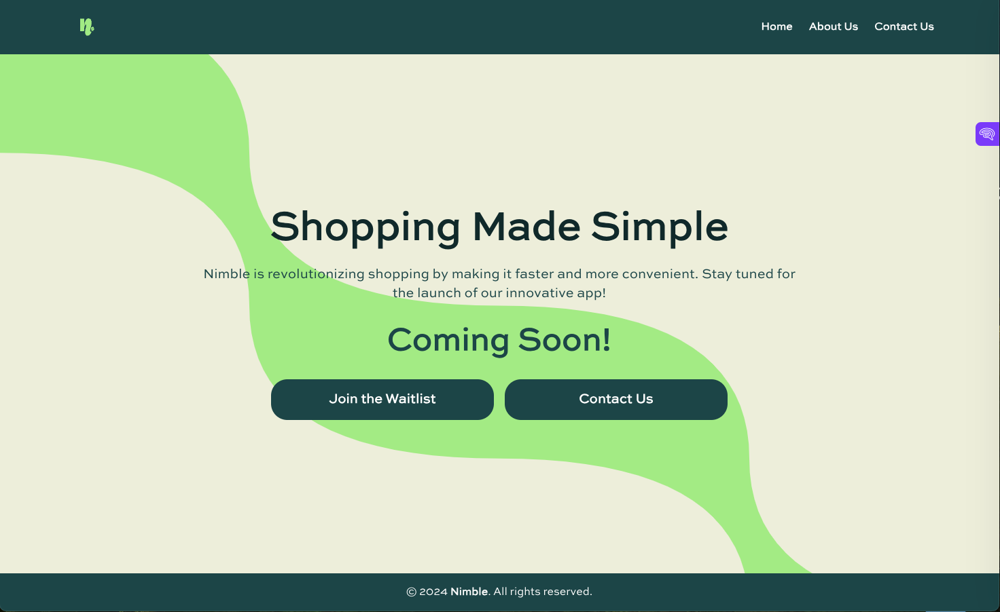
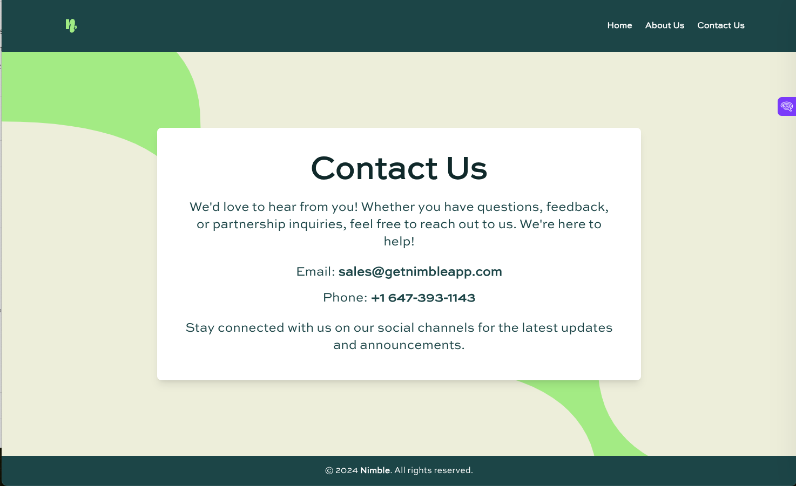
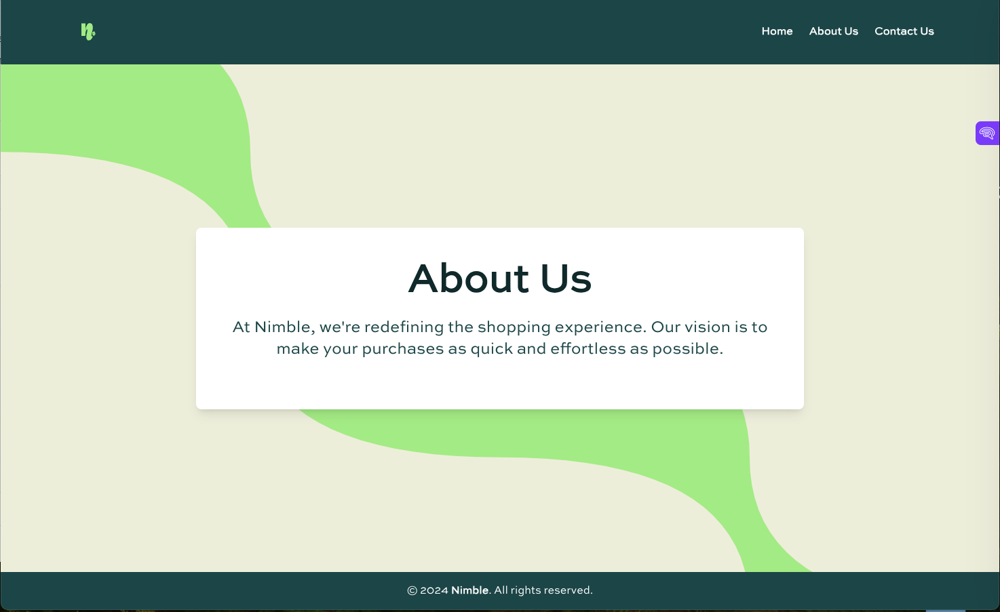

# Nimble Shopping Web App

This project is a shopping web application built with [Create React App](https://github.com/facebook/create-react-app). The application provides a modern and simple interface for users to learn about our service, join the waitlist, and contact us.

## Screenshots

### Home Page

### Contact Us Page

### About Us Page

## Available Scripts

In the project directory, you can run:

### `npm start`

Runs the app in development mode.\
Open [http://localhost:3000](http://localhost:3000) to view it in your browser.

The page will automatically reload when you make changes.\
You may also see lint errors in the console.

### `npm test`

Launches the test runner in interactive watch mode.\
See the section about [running tests](https://facebook.github.io/create-react-app/docs/running-tests) for more information.

### `npm run build`

Builds the app for production in the `build` folder.\
It correctly bundles React in production mode and optimizes the build for the best performance.

The build is minified, and the filenames include the hashes.\
Your app will be ready for deployment!

See the section about [deployment](https://facebook.github.io/create-react-app/docs/deployment) for more information.

### `npm run eject`

**Note: This is a one-way operation. Once you `eject`, you can't go back!**

If you're unsatisfied with the build tool and configuration choices, you can `eject` at any time. This command will remove the single build dependency from your project.

## Deployment on Vercel

This project can easily be deployed on Vercel:

1. Push the project to a Git repository (GitHub, GitLab, Bitbucket).
2. Visit [Vercel](https://vercel.com), sign up or log in.
3. Create a new project and link it to your Git repository.
4. Deploy the app by selecting the repository and configuring build settings (if needed).

For more details, see [Create React App Deployment Documentation](https://facebook.github.io/create-react-app/docs/deployment).

## Learn More

You can learn more about Create React App in the [Create React App documentation](https://facebook.github.io/create-react-app/docs/getting-started).

To learn React, check out the [React documentation](https://reactjs.org/).

### Advanced Configuration

For more advanced configuration, see the [Advanced Configuration Documentation](https://facebook.github.io/create-react-app/docs/advanced-configuration).

### Code Splitting

Learn about code splitting here: [Code Splitting](https://facebook.github.io/create-react-app/docs/code-splitting)

### Analyzing the Bundle Size

Find out more about analyzing your bundle size here: [Analyzing Bundle Size](https://facebook.github.io/create-react-app/docs/analyzing-the-bundle-size)

### Making a Progressive Web App

Learn more about making your app a Progressive Web App here: [Making a Progressive Web App](https://facebook.github.io/create-react-app/docs/making-a-progressive-web-app)

### `npm run build` fails to minify

Learn more about resolving build errors here: [Troubleshooting Build Failures](https://facebook.github.io/create-react-app/docs/troubleshooting#npm-run-build-fails-to-minify)
